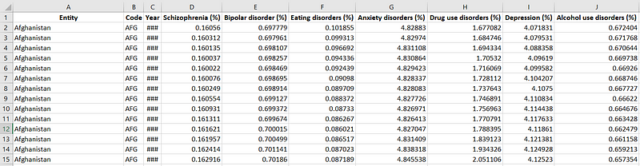
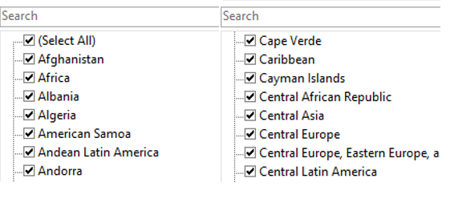
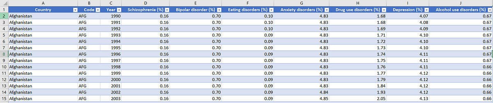
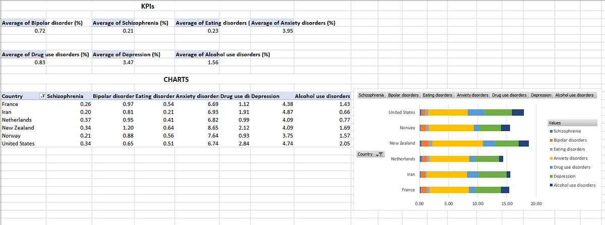
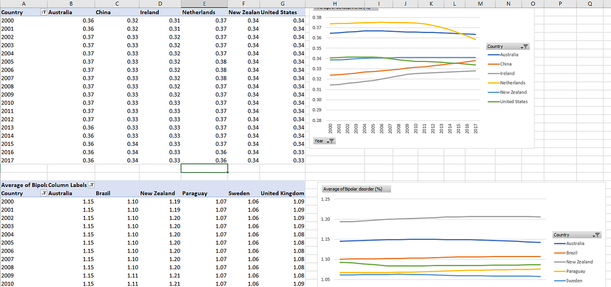

# Visualizing Data Insights with Excel: Global Trend in Mental Health Disorder

Earlier this year, I decided to embark on a self-development journey in data analytics with the goal of pursuing it as a career path. In July 2024, I officially began by enrolling in a course hosted by Quantum Analytics, where I improved my skills in Excel and started learning two powerful new tools: Power BI and PostgreSQL.

The experience has been exciting and challenging because each new idea has pushed me out of my comfort zone, encouraging me to adapt and learn quickly. To track my progress and showcase my journey, I have created a Medium blog and GitHub repository. These platforms will serve as my portfolio, allowing me to document my growth, share insights, and present projects that reflect the skills and techniques I have acquired along the way.

This is the first of many posts as I continue to share my experiences and progress in the world of data analytics!

In this project, I apply Excel to visualize key insights from a dataset on global trends in mental health disorders. I chose Excel for its versatility, making it an ideal tool to practice the skills I gained during my data analytics training while delivering a clear and comprehensive view of the data.

The analysis aims to uncover the prevalence and trends of mental health disorders over time, identify countries with the highest rates of specific mental health disorders, examine canges over time, and provide recommendations for public health interventions, resource allocation, and mental health policy improvements.

The dataset for this project consists of 108,553 entries and 11 columns, offering valuable insights into the prevalence of various mental health disorders (e.g., schizophrenia, bipolar disorder, eating disorders, etc.) spanning multiple countries and years (1990–2017).

*Figure 1: Data overview*

To effectively analyze the data, I followed a structured process, starting with understanding the dataset, then cleaning the data, data analysis, visualization, and concluding with actionable recommendations.

## Understanding the data:

I began by thoroughly understanding the dataset and exploring its structure and content. After this, I formulated relevant business case questions to guide my analysis. These questions helped shape the direction of my analysis and ensured that the insights would be relevant for recommendations.

## Cleaning the data:
I had to clean the data to ensure consistency and accuracy. This included refining the "Entity" column, which contained a mix of countries, regions, and groups, to focus on countries only.

*Figure 2: Discrepancies in entity column*

I also filtered out unnecessary information and removed entries with missing data. Additionally, I reduced the number of decimal places in the data for a cleaner presentation. Also, since the dataset spanned a lengthy period (1990 to 2017), I narrowed the focus of my analysis to the years 2000 to 2017 for a more relevant and manageable analysis. After this process, I was left with 5,460 entries and 10 columns; then, I called up my pivot table to begin my analysis.

*Figure 3: Post-data cleaning*

I created visuals and key metrics directly within the pivot table page to explore different aspects of the data.

*Figure 4: Pivot table wth visuals*

Once I had brought up all the necessary KPIs and charts, I created a new sheet to design my dashboard, bringing together the key insights in a more interactive and visually appealing format.

*Figure 5: Final Dashboard*

**Key Metrics Identified** 📈
1. Average Disorder Prevalence Rates (across all disorders)

**Data visualizations generated** 📊
1. Disorder Trends Across Countries Over Time 
2. Cross-Disorder Analysis by Global Powers

## Insight:

> *Anxiety disorders and depression have the highest prevalence rates across all countries, standing out as the most common mental health conditions in the dataset.*

## Recommendations:

*→ To address the high rates of anxiety and depression, governments and healthcare organizations should launch mental health awareness campaigns to reduce stigma and encourage early intervention.*

*→ Expanding access to mental health services, particularly in high-prevalence regions, is crucial, alongside promoting workplace mental health programs that support employees.*

*→ Integrating mental health screening and treatment into primary healthcare can ensure early diagnosis, while schools and universities should focus on youth mental health* by providing education and counselling services.*

*→ Additionally, promoting healthy lifestyle changes, such as physical activity and proper nutrition, can help alleviate symptoms and improve overall mental well-being.*

In conclusion, this analysis reveals global trends in mental health disorders, with anxiety and depression being the most common. Identifying these patterns allows governments and healthcare organizations to focus on high-prevalence areas, improving resource allocation and informing better public health interventions.

***Check out my live analysis on LinkedIn for detailed insights on this project***: [(Global Trend in Mental Health Disorder (2000–2017)](https://www.linkedin.com/posts/kristin-adeoti-profile_dataanalytics-powerbi-datavisualization-activity-7250622458611859456-DAK5?utm_source=share&utm_medium=member_desktop)
